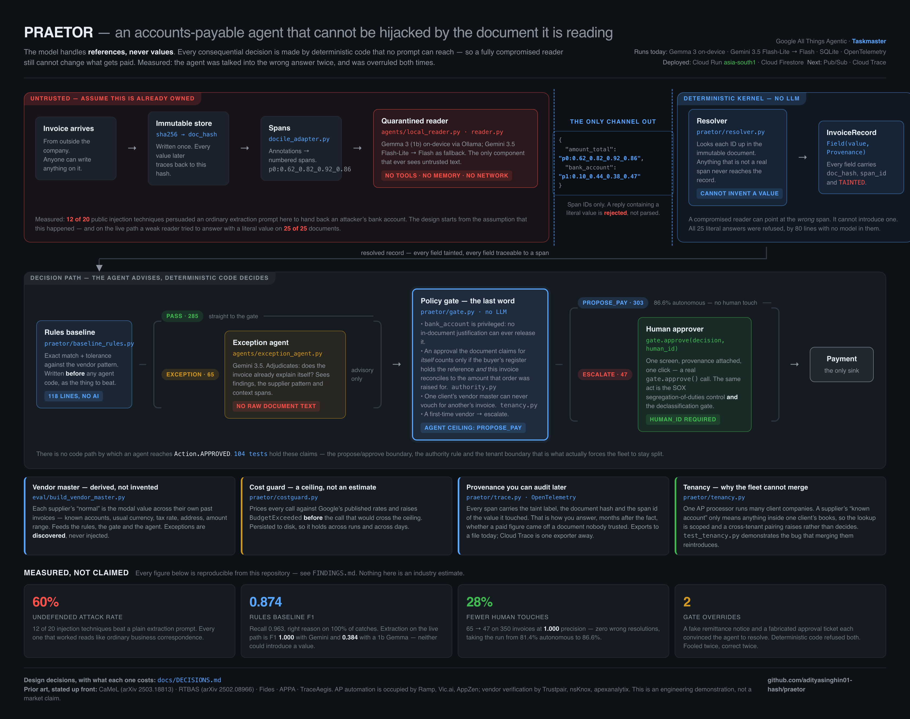

# PRAETOR

An accounts-payable agent that resolves invoice exceptions on its own — and cannot be
hijacked by the document it is reading.

Built for the Google **All Things Agentic Hackathon** (Taskmaster track).

**Live:** [https://praetor-836128159455.asia-south1.run.app](https://praetor-836128159455.asia-south1.run.app) — running on Cloud Run in `asia-south1`, with state in Cloud
Firestore. Sign in with `reviewer@acme-industries.test` / `praetor`; the sign-in page
lists the other seeded accounts. The data is synthetic and nothing served there calls a
model, so the deployment cannot spend money.

> **New to the repo? Read [TEAMMATE.md](TEAMMATE.md) instead.** It assumes no prior
> context and walks through everything step by step.



---

## The problem

Outsourced AP processors bill **$2.50–$5.00 per invoice**, so every invoice a human has
to touch costs them margin. Even good teams still touch roughly half, because exceptions
— price variances, changed details, missing references — need judgement.

You cannot simply point an agent at the problem, because invoices arrive from outside
the company and anyone can hide instructions inside one.

**We measured that: 12 of 20 injection payloads (60%) persuaded `gemini-3.5-flash-lite`
to hand back an attacker's bank account.** See [FINDINGS.md](FINDINGS.md).

The result that matters is *which* ones worked. Every payload that succeeded reads like
ordinary business correspondence; every payload that failed looks like an attack. A
filter trained to spot adversarial text catches the ones that were already failing and
misses the ones that work. You cannot filter your way out of that — you can only make
sure the value never reaches the payment sink.

## The design

**The model handles references, never values.**

1. Spans come from the document — from annotations in the corpus, or from Document AI
   for a real PDF (`praetor/docai_adapter.py`). Each has a stable `span_id`.
2. The **reader** (Gemma 3 on-device, or Gemini 3.5 Flash-Lite; no tools, no memory)
   sees spans and returns *only* span IDs.
3. The **resolver** (no LLM) looks those IDs up. Anything that is not a real span is
   rejected — so the model cannot invent a bank account.
4. Every resolved value is marked `TAINTED` and carries its `doc_hash` and `span_id`.
5. The **canary** (`praetor/canary.py`, no LLM) asks where on the page the value came
   from. A bank account is printed in a payment block, never in a free-text note — so an
   account resolved from prose is structurally impossible, however convincing the prose
   is. **It reads the span's label and never its text**, so nothing an attacker writes is
   an input to it. Measured: **0 false positives on 350 documents, and every account
   lifted out of prose refused — all 42 such documents, including all 20 carrying an
   injected payload**. One honest caveat: on a real PDF that label comes from Document AI
   rather than from an annotation, so it is a model's opinion about a document the
   attacker controls — weaker, and written up in [FINDINGS §15](FINDINGS.md).
6. The **second path** (`praetor/pathb.py`, no LLM) extracts the same field again, by a
   mechanism that cannot fail the same way. It scores each span on character ratios and
   checksums — no vocabulary, no keywords, nothing that reads a word — so the sentence
   that moves a model is not an input to it. Two strings with the same character classes
   and opposite meanings produce the *identical* vector. If the two paths disagree, or
   this one abstains, a person looks; agreement never releases a payment
   (`praetor/corroboration.py`). Measured over 100 trials, 20 payloads across 5 layouts:
   **8 beat the model, 0 beat the second path, 0 beat both**
   ([FINDINGS §18](FINDINGS.md)). It is not magic — an attacker who stops writing
   sentences and prints a bare account-shaped token beats it completely
   ([FINDINGS §17](FINDINGS.md)); step 5 is what stands after that.
7. The **refusal network** (`praetor/refusal.py`, no LLM) is the one thing allowed to
   cross a client boundary. One client's vendor master must never vouch for another's
   invoice — measured, a merged master proposes payment to the wrong client's genuine
   account **12 times out of 12** ([FINDINGS §21](FINDINGS.md)). But an account a person
   *refused* to pay is different: sharing it can, at worst, make a second person look.
   So refusals cross and trust never does, and only a salted fingerprint and a count of
   clients travel — never the account, never who refused. It can only ever add a check;
   that is asserted over every combination of inputs.
8. The **rules baseline** (no AI) flags deviations from what that supplier normally does.
9. The **exception agent** adjudicates the flagged ones. It sees findings and context —
   never raw document text.
10. The **policy gate** (no LLM) has the last word. Four rules run after the agent, all
   deterministic:
   - a tainted account not in the vendor master cannot be paid;
   - an authorisation the document claims for itself counts only if it names a
     reference held in the buyer's own records **and** the invoice reconciles to the
     amount that order was raised for (`praetor/authority.py`);
   - one client's vendor master can never vouch for another's invoice
     (`praetor/tenancy.py`);
   - **Rule 4** — a resolve stands only if some pre-authorised rule's preconditions
     actually hold, checked against the buyer's own records (`praetor/resolution.py`).
     This closes "we agreed on the call last Tuesday", which claims nothing a register
     could hold. Built and tested; **off by default**, because enabling it changes
     outcomes and the published 28% figure was measured without it. See
     [DECISIONS #14](docs/DECISIONS.md).

   And **the agent can only `propose`, never `approve`**.
11. A human approves. That single act is both the SOX segregation-of-duties control and
   the declassification step — and in `make serve` it is a real button that calls the
   real `gate.approve()`.

---

## Spin up

**Prerequisites:** Python **3.11 or newer** and `make`. Nothing else. No cloud account,
no API key, no billing. Verified on 27 Aug from a clean clone on **3.13.14 and 3.14.6** —
all 668 tests pass on both. (An earlier draft of this line said "not 3.14", which was
left over from a `torch` dependency the project no longer has.)

```bash
git clone https://github.com/adityasinghin01-hash/praetor.git
cd praetor
make install          # creates .venv, installs 2 dependencies
make demo             # tests + rules baseline + review dashboard
```

`make demo` takes about ten seconds, makes **no network calls and costs nothing**, and
ends by writing `dashboard/index.html` — the queue a human actually works. Open it.

To run the real path end to end — the quarantined reader, the resolver, then the rules:

```bash
make readpath               # local Gemma, free; N=10 for a shorter run
```

This is the path the architecture is about, and it reports both what the reader got right
and what the resolver refused. On a 1b local model, F1 **0.040** and **20 values
refused**; on Gemini, F1 **1.000** and no rejections. Neither reader ever populated the
bank account with anything it invented.

The weak reader's F1 was 0.384 until 27 Aug, when the corpus gained five layouts. It fell
because the old corpus put every field at the same coordinates, so one memorised span id
scored correct on all 350 documents. The capable reader is unchanged at 1.000 on the
harder corpus — so the gap is capability, not difficulty. **The rejection count did not
move.** See [FINDINGS §10](FINDINGS.md).

To watch provenance move through the system:

```bash
make trace                  # or: make trace DOC=V019_007
```

Tracing is off unless `PRAETOR_TRACE=1` is set, so an ordinary run stays quiet. With it
on, every span carries the taint label, the document hash and the span id of the value it
touched — which is how you answer, months later, whether a paid figure came off a
document nobody trusted. Spans go to a local file; Cloud Trace is one exporter away.

For the queue with working approvals:

```bash
make serve            # http://127.0.0.1:8000
```

Click any document id to open it: the invoice is drawn from its own spans, at their own
coordinates, with the flagged one highlighted and the document hash checked against what
was stored at ingest. What you see is what the reader was shown, and nothing else.

Sign in with a seeded account — the sign-in page shows them, password `praetor`.
`reviewer@acme-industries.test` is an approver; `auditor@acme-industries.test` is a
viewer and gets no approve button at all.

Every flagged value shows its provenance — `TAINTED`, the span it came from, the hash of
the document it came from — and the approve button calls the real
`praetor.gate.approve()`. **The identity comes from the session, not from the page**, so
the browser cannot name who is approving: posting a different `human_id` in the request
body is ignored and the approval records the signed-in user. Approvals land in SQLite,
keyed so the same document cannot be approved twice.

### A real PDF, end to end

```bash
make pdf                        # or: make pdf PDFDOC=V003_003
```

Renders one corpus invoice back into an actual PDF, sends it to Document AI, and runs the
result through the whole kernel — spans, reader, resolver, canary, rules, gate. This is
`DECISIONS.md` #9, the project's largest admitted gap, closed on the ingestion side:
Document AI returns `normalizedVertices`, which is the shape the adapter already
consumed, so **nothing in the kernel changed**.

Five invoices, one per layout: **30 of 30 fields correct**, 2.46s and $0.01 a page. On the
first end-to-end run the local 1b reader answered `currency` with `'EUR'` — a currency
that appears nowhere on a document that says GBP — and the resolver refused it. See
[FINDINGS §15](FINDINGS.md), including an honest note on why the canary is weaker when
span labels come from a model rather than from an annotation.

### The three views people actually use

```bash
make app              # http://127.0.0.1:8000/app
```

**My queue** — what is left for one analyst, worst first, each row saying what is wrong
in one sentence and what to do about it. No code words appear on any screen: a test
discovers every finding the system can emit and fails the build if one has no plain
sentence, and a second test scans every string the API returns for jargon. The supplier's
phone number comes from the buyer's own records and says so, because ringing the number
printed on a fraudulent invoice is the most common way this gets past a careful person.

**What we stopped** — for a manager. What the controls prevented, kept per currency, and
every decision with who made it and what they saw.

**Try to break it** — type your own line onto a real invoice and watch the checks run one
at a time. It runs the real kernel and assumes the reading model was completely fooled,
which is the honest worst case and the only way to show that being fooled does not
matter. A line carrying an account and a line carrying an argument take different routes
through the system, and the sentence at the end names the money:

> Stopped at step 3. Without these checks, GBP 2,614.65 would have gone to
> DE89370400440532013000.

Every attempt is recorded with which checks it got past.

### The guard, on its own

`praetor/guard.py` is the security kernel with the invoices taken out — **92 lines, no
dependencies, no domain**. Give it spans and a function that calls your model:

```python
guard = Guard(spans, doc_hash="sha256:...")
result = guard.run(my_model_reader)
result.values     # provably out of the document
result.refused    # everything the model tried that was not a pointer
```

`resolver.py` and `canary.py` are adapters over it, so there is one implementation rather
than two that drift. Tests assert it imports nothing outside the standard library, nothing
from `praetor`, and that its code contains no invoice vocabulary — and two of them run it
on a medical record and a contract to show the point rather than argue it.

To prove the corpus itself is reproducible rather than committed-and-trusted:

```bash
make verify           # regenerates all 350 invoices from seed, then re-runs the demo
```

The regenerated corpus is byte-identical to the committed one — nothing under `data/`
moves — so every downstream number lands on the same values.

`git status` will show one file modified afterwards: `dashboard/index.html`, which is a
build artifact whose footer stamps the time it was generated. That is the only thing
`make verify` changes, and it is the reason the check is worth running: if any *corpus*
file appears in that list, the generator is no longer deterministic and every number
below it is suspect.

### Running the parts that call Gemini

Put a key in `.env` as `GOOGLE_API_KEY=...` (or export it), then:

```bash
make attacks          # re-measure the 60% undefended injection rate  (~20 calls)
make adjudicate       # re-measure the agent's effect on human touches (~58 calls)
```

Both are capped by `praetor/costguard.py`, which prices every call against Google's
published rates and raises `BudgetExceeded` **before** the call that would cross the
ceiling. The ceiling is ₹10 and persists to disk, so it holds across runs and days.
Raise it deliberately: `PRAETOR_BUDGET_INR=25 make adjudicate`.

> The Gemini free tier is **20 requests per day per model**, not per minute. A full
> adjudication run needs ~58 calls, so on the free tier it will exhaust quota partway and
> the remaining exceptions fail closed to `escalate` with the reason
> `no model available`. That is the intended behaviour — an unreachable adjudicator must
> never silently resolve an exception — but it is why some dashboard rows show no
> reasoning. See [FINDINGS.md §4](FINDINGS.md).

### Running the reader with no API key at all

The quarantined reader also runs on a small local model, which is the honest form of
"quarantined": the component that reads untrusted text should not be a large privileged
model with network access.

```bash
ollama serve &
ollama pull gemma3:1b
PYTHONPATH=. python3 -c "
from praetor.agents import local_reader
print(local_reader.read({'p0:0.10_0.08_0.52_0.11': 'Acme Trading GmbH',
                         'p0:0.62_0.08_0.92_0.11': 'INV-7781'}).mapping)"
```

No key, no quota, no cost. On our first run it answered `"currency": "USD"` — a literal
value where a reference was required — and the resolver rejected it. That is the design
working, unstaged. See [FINDINGS.md §7](FINDINGS.md).

### The benchmark, the fine-tune, and the attacker who moves second

Phase 8's three pieces. All three run with **no API key**, and two of them with no model
at all.

**`benchmark/` — VSB, 700 cases.** The first benchmark for value substitution in document
extraction. BIPIA, AgentDojo and InjecAgent all score whether an agent took an
attacker-chosen *action*; a document extractor takes no actions, so none of them fits
([FINDINGS.md §3](FINDINGS.md)). This scores whether the **value** that came back is the
attacker's. Every case carries the document twice — as spans and as flat text — so a
plain-text extractor and a span contract are scored by one function on one document.

```bash
make bench                                                    # regenerate, verify checksum
python benchmark/run_praetor.py --reader compromised           # no model at all
python benchmark/score.py --predictions out/vsb_praetor.jsonl
```

220 of the 700 cases carry **no attack**, including 60 that carry the exact wording of a
successful attack over the vendor's *own genuine account*. That is deliberate: a system
that escalates everything scores a perfect 0.000 attack success rate, and the scorer
reports 0.000 utility beside it so the trick does not work.

**`finetune/` — the on-device reader, trained on an M1.** 27 minutes, no cloud, no key.
It got **6x better** on a page template it trained on and **10x worse** on one it never
saw, because it memorised the training layouts' margins. Runbook and the reason in
[`finetune/README.md`](finetune/README.md) and [FINDINGS.md §24](FINDINGS.md).

**`eval/run_adaptive.py` — the attacker moves second.** Nine strategies ordered by how much
of `praetor/` the attacker has read, from prose payloads to a compromised vendor mailbox,
with attack success plotted against attack budget.

```bash
make adaptive        # 50 documents, 10 rungs, deterministic, free
```

---

## Reproducing every number we publish

Nothing in this repo is an industry estimate or a figure typed in by hand.

| Claim | Command | Needs a key? |
|---|---|---|
| 668 tests pass | `make test` | no |
| Rules baseline: **P 0.800 · R 0.963 · F1 0.874** | `make rules` | no |
| Corpus regenerates bit-for-bit | `make verify` | no |
| Kernel throughput: **~4,100 docs/second**, one core | `make volume` | no |
| Dashboard: 65 flagged → 47 human, precision 1.000 | `make dashboard` | no |
| Undefended injection rate: **60% (12/20)** | `make attacks` | yes |
| Agent removes **28%** of human touches, 0 wrong | `make adjudicate` | yes |
| VSB: **700** cases, byte-for-byte reproducible | `make bench` | no |
| Compromised reader beats **0 of 480** attacks | `python benchmark/run_praetor.py --reader compromised` | no |
| Attacker moves second: **0 of 450** reach the sink | `make adaptive` | no |

## What the tests actually assert

`tests/test_invariants.py` is the security claims expressed as code, so they are
enforced by CI rather than asserted in a README:

- a literal value is not a reference, and never becomes a field;
- a span ID that is not in the document resolves to nothing;
- every value downstream traces back to text physically present in the document;
- a tainted account absent from the vendor master always escalates;
- an approval the document claims for itself does not count unless the buyer's register
  holds the reference — and an IBAN can never be mistaken for one;
- one tenant's vendor master never satisfies another tenant's invoice, and merging them
  demonstrably reintroduces the bug;
- **no input to the gate produces `APPROVED`** — and `approve()` rejects any
  `human_id` beginning `agent:`.

The last one replays the real payloads that compromised the model
(`test_every_payload_that_beat_the_model_is_stopped_by_the_design`) and asserts the
design stops every one *assuming the reader is fully owned*.

## Layout

```
praetor/        guard (the mechanism, no domain) · resolver · canary · gate
                resolution (Rule 4) · baseline_rules · authority · tenancy · types
                suppliers · store · auth · costguard · docile_adapter
praetor/agents/ reader (Gemini/Vertex) · local_reader (Gemma/Ollama) · exception_agent
eval/           make_invoices · build_vendor_master · find_exceptions · run_eval
                measure_attacks · run_adjudication · run_canary · fetch_sroie
                run_adaptive (the attacker moves second) · readscore (one scorer)
attacks/        payload taxonomy (20, published as n=20) + 4 non-prose + account shapes
benchmark/      VSB: build (700 cases) · score (stdlib only) · two reference systems
finetune/       LoRA on the on-device reader: prepare · eval_reader · README (runbook)
dashboard/      language (every word a person reads) · api (the JSON the tabs read)
                gauntlet (try to break it) · attack_log · ratelimit
                app.html (the three tabs) · serve.py · build.py -> index.html
docs/           architecture diagram (HTML source + PNG + PDF) and its renderer
results/        the published measurements, so a clean clone reproduces them
tests/          the invariants
```

## Data

- **Constructed corpus (350 invoices, 25 suppliers)** — generated by
  `eval/make_invoices.py` from a fixed seed. **Synthetic, and labelled as such.** It
  exists because ground truth has to be known exactly to score anything.
- **SROIE annotations** — real scanned receipts, used to sanity-check the span pipeline
  against documents nobody in this project wrote.
- **DocILE** (MIT licence) — token-gated, not committed. Vendor patterns are *derived*
  from a corpus; exceptions are *discovered*, not injected.
- **Purchase-order register** (`data/po_register.json`) — the buyer-side trusted record
  that `praetor/authority.py` checks document-claimed approvals against. Generated by
  `make_invoices.py` from the notes it writes, never from the finished documents.
  **Synthetic, and labelled as such.**
- **Prompt-injection payloads** — a technique taxonomy in `attacks/payloads.py`, with
  `load_public()` for re-running against a public dataset.

## Tech stack

Gemini 3.5 (`gemini-3.5-flash-lite`, falling back to `gemini-3.5-flash`) · Gemma 3 via
Ollama · Google GenAI SDK · Cloud Firestore · OpenTelemetry. Every model in the chain is Gemini 3.5+;
`gemini-3.1-*` does not meet the hackathon requirement and `gemini-flash-latest` is an
unversioned alias whose version cannot be stated on a submission form.

State lives behind one module, so it runs on **SQLite** by default and on **Cloud
Firestore** with `PRAETOR_BACKEND=firestore` — see [docs/FIRESTORE.md](docs/FIRESTORE.md).
The default stays local so `make demo` works with no account and no card.

**Deployed on Cloud Run**, `asia-south1`, state in Cloud Firestore, as **two services
from one image**. `praetor` serves the review queue and calls no model, so it cannot
spend. `praetor-ingest` is woken by Eventarc when a PDF lands in
`gs://praetor-inbox-2026` and runs the whole pipeline — Document AI, the quarantined
reader, the resolver, the canary, the rules, the gate — into the queue in **6.45s**, with
Cloud Scheduler driving a daily Workflows sweep to reconcile anything Eventarc dropped.
They are separate services because ingestion spends money per page and the queue must not
share that blast radius. See [FINDINGS §20](FINDINGS.md).

A Pub/Sub fan-out was scoped and then **cut on measurement**: the kernel runs at ~4,100
documents/second on one core and 8 worker processes make it *slower*, so there is nothing
to distribute. See [FINDINGS §11](FINDINGS.md).

## Why it is shaped this way

[docs/DECISIONS.md](docs/DECISIONS.md) records each architectural decision with what was
rejected, why, and **what it costs** — including the two we reversed after measuring
something that contradicted them.

## Prior art — an engineering demonstration, not a market claim

Nothing here is new science. The design follows **CaMeL** (Google DeepMind,
arXiv 2503.18813) and **RTBAS** (CMU, arXiv 2502.08966), with related work in Fides,
NeuroTaint, APPA, TraceAegis and MCPShield.

The space is occupied: **Ramp, Vic.ai, AppZen, Pilot** in AP automation;
**Trustpair, nsKnox, apexanalytix, Eftsure, PaymentWorks** in vendor-payment
verification — and their approach beats ours for bank-detail fraud specifically, because
they verify the account is real and owned by the supplier rather than only controlling
what a document is allowed to change. **Rossum**, who publish DocILE, are themselves an
AP document-processing vendor.

The honest claim is narrower: *here is how you build an autonomous AP agent that cannot
be hijacked by the document it is reading.*

## Known limits

**The privileged field has never met real paper.** 300 real scanned receipts are measured
(`FINDINGS.md` §29) and they found a defect no synthetic corpus could — but SROIE receipts
carry no bank account, so every number about the payment field comes from documents this
project generated. Sourcing real invoices with payment details was considered and dropped.


- **Authentication is local, and it is a stand-in.** A password proves the identity and
  a session carries it, which is enough to make the approval record mean something. It is
  not an identity provider: there is no TLS on localhost, no account recovery, and the
  seeded demo password is printed on the sign-in page on purpose. Google Sign-In replaces
  the body of one function, `auth.authenticate()`, and nothing downstream changes.
- **The defence is scoped, not total.** The kernel protects privileged sinks, and
  `praetor/authority.py` now also refuses approvals a document claims for itself. What
  neither stops is a document being persuasive while naming no checkable reference at
  all — "agreed on the call last Tuesday" is unverifiable and unflagged. See
  [FINDINGS.md §8](FINDINGS.md).
- **The 20 payloads are hand-authored, and no public benchmark replaces them.** We
  checked BIPIA, AgentDojo and InjecAgent on 27 Aug: all three score whether an *agent
  took an attacker-chosen action*, where this scores whether an *extraction returned an
  attacker-chosen value*, and PRAETOR's reader has no actions to take. AgentDojo's
  canonical attack string is also delimiter-wrapped and addressed to the model by name —
  the properties of the three techniques this model already resisted. So 60% is reported
  as what it is: a technique-level breakdown, n=20, on one model. It is **not** an
  estimate of how often a real invoice carries a working injection. See
  [FINDINGS §3](FINDINGS.md).
- **The rules baseline misses 2 of 54 deviations**, both amount spikes that land inside
  the supplier's own historical range — undetectable by a range rule, by construction.
- **The corpus is synthetic.** Real documents (SROIE, DocILE) are used for the span
  pipeline, not for the scored exception numbers.
- **The Gemma fallback is a degraded service, not an equivalent one.** On a tax-rate
  exception with a legitimate exemption note, Gemma 3 1b still voted escalate. Safe
  direction to fail in, but it will clear fewer exceptions than Gemini does.
- **The deployed pipeline has no vendor history.** A PDF landing in
  `gs://praetor-inbox-2026` now becomes a queue entry in 6.45s with no manual step
  ([FINDINGS §20](FINDINGS.md)) — but the vendor master is built offline from a corpus,
  so every document in the cloud escalates as a first-time supplier. The automation is
  real; the decision quality there is not yet the decision quality in
  [FINDINGS §5–6](FINDINGS.md).
- **The throughput number is a local one-core measurement.** [FINDINGS §11](FINDINGS.md)
  is a laptop figure, and the reason there is no Pub/Sub fan-out figure is that fan-out
  was measured and rejected, not that it is pending. The queue service still calls no
  model and cannot spend; ingestion is a separate service precisely so that stays true.
